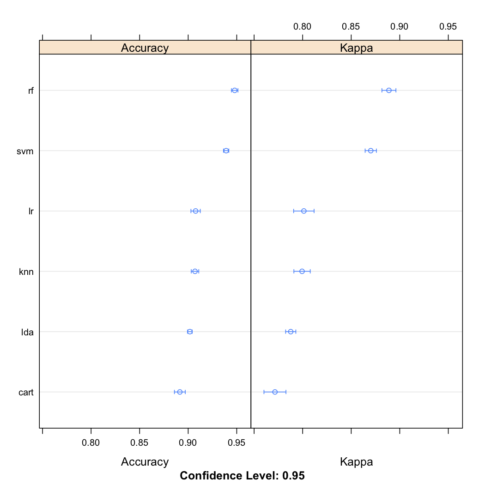
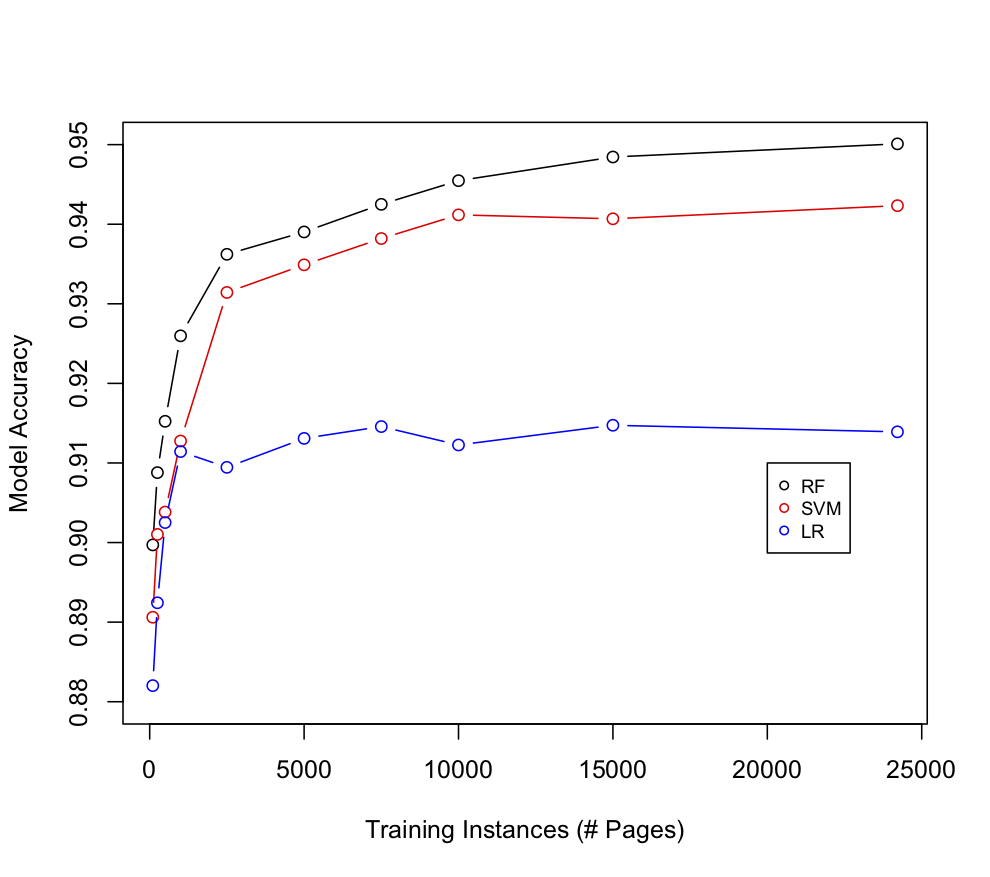

# Initial Findings Regarding Front Matter Identification in HT

This exploratory aims to assess the overall feasibility
of applying machine learning techniques to the problem of discriminating
between *factual* and *creative* content in the initial pages of
Hathi Trust (HT) volumes.  The basic problem statement runs like so:
Given a HT volume *V*, analyze the first *n* pages of *V* (where *n*
is a small integer, on the order of 5-30).  For each of these *n* pages
*p<sub>1</sub>, p<sub>2</sub>, ..., p<sub>n</sub>*, we seek a prediction
*p<sup>'</sup><sub>i</sub>* in *{factual, creative}* that can guide
a decision whether or not to "expose" *p<sub>i</sub>* to the public.

N.B. In my analysis, I refer to *factual* and *creative* as *open* and
*closed*, respectively.  Thus the aim is make a prediction in 
*{open, closed}* for each page *p<sub>i</sub>*. Thus, successful predictions
will allow HT to expose open pages to the public while keeping access to
creative pages under stricter control

The page labels (i.e. the ground truth) used in this analysis are described in
* Lara McConnaughey, Jennifer Dai and David Bamman (2017), "The Labeled Segmentation of Printed Books" (EMNLP 2017)
and are available [here](https://github.com/dbamman/book-segmentation).  The
data consist of 1055 HT volumes with publication dates between 1750 and 1922.
These 1055 volumes contain a total of 294,816 pages.
For each volume in the data set, McConnoaughey et al labeled each page with one
of ten categories (e.g. TOC, index, title page, advertisement, main text, etc.)

It is worth
noting that the volumes and labels used here were collected in service to a problem
similar to the one we are considering but not identical to it. The salient 
differences between McConnaughey et al's problem and ours are:
* *Dates:* While our interest lies in volumes published after 1922, McConnaughey
et al selected volumes published in or prior to 1922.
* *Labels:* Our task is simpler than MConnaughey's.  Instead of predicting the
structural role that each page plays in a given volume, our aim is simply to assess
whether each page is inherently *factual* or *creative*.  In other words, our
target variable's sample space is of size 2, while McConnaughey et al treat
the target as a 10-category variable.  This analysis resolves this difference
by mapping each of McConnaughey et al's 10 categories onto *{factual/open,
creative/closed}*.  I performed this mapping myself.
 

## Selection of *n*, The Number of Pages Under Consideration
Before approaching the task of labeling individual pages, we considered 
simpler question: *Is it possible to select an integer n such that exposing the
first n pages of all volumes will show a reasonable proportion of factual content
while hiding most of the creative content?*


**Figure 1. False Positive/Negative Counts as a Function of *n*, the Number of Pages Exposed**

Figure 1 suggests that this approach does not lead to a satisfying outcome.  The
figure shows two plots (hence the different scales shown on the graph's *y*-axis).  

In both plots the *x*-axis is *n*, the number of pages hypothetically 
exposed per volume. In blue, the figure shows the number of false positives at
*n*.  In other words, each blue point gives the number of pages with a *closed*
label (i.e. creative content) erroneously exposed under the hypothetical policy
of opening the first *n* pages per volume.

The red points in the figure correspond to false negatives.  That is, for a given
*n*, how many factual pages have we failed to expose?

Figure 1 suggests that no single value of *n* yields a good outcome.  For instance,
if we chose the very conservative policy of exposing only the first *n=5* pages
of our 1055 volumes we have a very high false negative rate (approximately 14,000
unexposed factual pages), while still incurring 171 exposed creative pages.  
Assuming that false positives (exposed creative/closed pages) is highly 
undesirable, Figure 1 suggests that we need a policy with more nuance than
simply opening the first *n* pages per volume. 


## Prospects for Success using Machine Learning to Expose Factual Pages
In the previous section we explored the "naive" strategy of exposing the first
*n* pages of each volume, and we found this strategy to be too blunt of an
instrument for deployment in the wild.  A more nuanced approach is to learn
a function *f(p<sub>i</sub>)* that, given as input a page *p<sub>i</sub>*, 
returns a prediction *o'<sub>i</sub>* that quantifies that likelihood that
*p<sub>i</sub>* is of class *open*.  In this section we discuss initial
results on the feasibility of learning such a function *f* using machine learning
techniques.

### Training Data
We use the labels created by McConnaughey et al to train the models described
below.  Thus we have 294,816 possible training instances--i.e. the labeled pages
from 1055 volumes.  However, we have altered these data slightly to suit our
needs more closely.  In particular, we altered the training data in two ways:
* *Target Variable:* As described above, we map each of the 10 structural page
categories used by McConnaughey et al onto the simpler scheme of *{open, closed}*.
For instance, pages labeled by McConnaughey et al as *TOC* take the label *open*
in our data, while pages labeled *preface* by McConnaughey are considered creative
and thus carry a *closed* label in our data.
* *Pages Under Consideration:* Though not strictly necessary, we have limited our
consideration to pages with sequence numbers <= 30.  That is, we consider only
the first 30 (or fewer) pages per volume in our analysis.  Thus we work with a total
of 30,266 labeled pages in the following discussion.

Of our 30,266 pages, 11,453 carry the *open* label, while 18,813 are of type
*closed*.

### Predictor Variables
To test the feasibility of using machine learning for the task at hand, we 
generated a set of 11 simple features for each of our 30,266 pages.

```
|-------------------------------------------------------------------------------|
| Variable Name			| Description					|
| ----------------------------- | --------------------------------------------- |
| seq				| The sequence/page number			|
| log_seq			| The log of the sequence number		|
| token_count			| Number of tokens on the page			|
| token_count_normalized	| (token_count - mean_tok_count)/std(tok_count)	|
| line_count			| Number of lines of text on the page		|
| line_count_normalized		| (line_count - mean_line_count)/std(line_count)|
| empty_line_count		| Number of empty lines on the page		|
| empty_line_count_normalized	| (empty_lc - mean_empty_lc) / std(empty_lc)	|
| cap_alpha_seq			| Longest observed sequence of alphabetical caps|
| pct_begin_char_caps		| % of lines that begin with a capital letter	|
| pct_end_char_numeric		| % of lines that end with a roman numeral	|
|-------------------------------------------------------------------------------|
```
**Table 1. Predictor Variables per Page.  N.B. Averages and Std Deviations are
taken at the volume level.**

The features shown in Table 1 were chosen for three principal reasons:
1. *Plausibility:* We chose features that we hoped would give a fair sense
of the level of accuracy obtainable using this general approach (i.e. machine
learning).
2. *Ease of Implementation:* These features are all easy to compute using the
HTRC Extracted Features data and the ```HTRC FeatureReader``` API.
3. *Data Agnostic:* Ostensibly, we hope to apply a machine learning approach to
the task of identifying factual content regardless of the language, age and
genre of a given volume.  The features shown in Table 1 ignore obviously important
information such as vocabulary use in efforts to generate a model that might
reasonably be applied across a wide variety of volumes from HT.

It is important to note that no effort was made to generate an optimal set of
predictive features.  Expediency and generalizeability were of paramount importance.
In future work, more features, and more expressive features will almost surely
improve the accuracy of learned classifiers, though perhaps at the cost of 
generalizeability across languages and genres.


### Learned Models
All models were obtained under the following setup.

First, the data were partitioned into training (80%) and validation (20%) sets.
Models were trained using 10-fold cross-validation on the training data, and
eventually tested on the validation set.

In the interest of breadth of inquiry, we trained models of varying structure
and type.  The models are summarized in Table 2.

```
|-------------------------------------------------------------------------------|
|Abbrev	| Name				| Description				|
|-------|-------------------------------|---------------------------------------|
|LDA	| Linear Descriminant Analysis	| A simple, linear model		|
|CART	| Classification Tree		| A simple, non-linear model		|
|LR	| Logistic Regression		| An easily interpretable GLM		|
|KNN	| K-Nearest Neighbors		| A non-linear, non-parametric model	|
|SVM	| Support Vector Machine	| A state-of-the art, non-linear model	|
|RF	| Random Forests		| A state-of-the art, non-linear model	|
|-------------------------------------------------------------------------------|
```
**Table 2.  Learned Models. All models contain all 11 predictors listed in Table 1.**

All models adopted the default parameterizations given in the ```R``` programming
language (except that the SVM model used the radial basis function kernel type).

### Obtained Results
Figure 2 schematizes the cross-validation accuracy of the models. The figure
shows model accuracy (via cross-validation) in the left column and Cohen's
Kappa in the right column.


**Figure 2. 10-Fold Cross-validation Accuracy**

Figure 2 is heartening in several respects.  First, and most basically, it appears
that even with a parsimonious and simple set of predictors the prospect of using
this sort of machine learning setup to expose factual content seems promising.  The
accuracy of almost all of the models was greater than 90% on average, with both
SVM and RF achieving average cross-validation accuracy ~95%.  

(N.B. Among our 30,266 sample pages 11,453 had a ground-truth label of *open*.  Thus
the accuracy obtained by the one-R rule of always choosing the dominant class was
only 62%, suggesting that all of the learned models have non-trivial predictive
power.)

A second interesting result visible in Figure 2 is the narrow error bars on each
model's cross-validation accuracy.  The figure's 95% confidence intervals suggest
two important results:
1. The more complex models such as RF and SVM appear to outperform the simpler
models, suggesting that this is a tractable but non-trivial prediction problem.
2. We do not appear to be in great danger of over-fitting our models using the
training data described here.  We return to this issue below.


```
|-----------------------|
| Model	| Accuracy	|
|-----------------------|
| LDA	| 0.9068	|
| CART	| 0.8881	|
| LR	| 0.9139	|
| KNN	| 0.9099	|
| SVM	| 0.9423	|
| RF	| 0.9504	|
|-----------------------|
```
**Table 3.  Validation Set Model Accuracy**

These results are reinforced by Table 3, which lists the accuracy of each model
on the validation set data.  Again, we see a high level of accuracy across the
models, with the strongest results coming from the more complex models.


### Analysis of Predictor Variables

```
                            Estimate Std. Error z value Pr(>|z|)    
(Intercept)                 8.220248   0.257898  31.874  < 2e-16 ***
seq                         0.153901   0.011918  12.913  < 2e-16 ***
log_seq                    -4.289811   0.160233 -26.772  < 2e-16 ***
token_count                -0.002508   0.000303  -8.277  < 2e-16 ***
token_count_normalized     -0.669308   0.039166 -17.089  < 2e-16 ***
line_count                 -0.019555   0.002922  -6.693 2.18e-11 ***
line_count_normalized       0.007086   0.047086   0.150   0.8804    
empty_line_count            0.022329   0.005170   4.319 1.57e-05 ***
empy_line_count_normalized  0.312050   0.034637   9.009  < 2e-16 ***
cap_alpha_seq              -0.057951   0.010944  -5.295 1.19e-07 ***
pct_begin_char_caps         0.217768   0.085176   2.557   0.0106 *  
pct_end_char_numeric        5.691780   0.204785  27.794  < 2e-16 ***
---
Signif. codes:  0 ‘***’ 0.001 ‘**’ 0.01 ‘*’ 0.05 ‘.’ 0.1 ‘ ’ 1
```
**Figure 3.  Statistical Properties of the Logistic Regression's Coefficients**

Because the predictors listed in Table 1 were chosen quite casually, it is 
natural to assess the extent to which each of the variables are contributing to
the prediction task.  In other words, is it the case that most of our variables
actually contribute to the model, or is it, say, the case that most of the models'
predictive accuracy comes from a small subset of the variables?

Figure 3 suggests that most of the proposed predictors are quite valuable.
The figure shows results only for the logistic regression model.  Results for
other models were very similar, and the coefficients of logistic regression
models are easy to interpret, which is why we focus on logistic regression in
this section.

With the exception of two variables (the normalized line count and the percent
of lines starting with a capital letter), all of the learned coefficients
were "highly statistically significant."  This suggests that we could probably
improve our models by devising and adding more--and more expressive--features.

As to why two of the features fail to show much predictive value, a few responses
present themselves immediately.  First, it is possible that the code I used to
generate the ```line_count_normalized``` variable contains a bug, and that the
variable may in fact be more helpful that it seems.  I believe this is plausible
given the merits of the non-normalized line count.  Thus, I will re-run these
experiments after re-checking the code.  With respect to ```pct_end_char_numeric```,
weak prediction is actually not surprising.  This variable is likely to be helpful
in indentifying segments such as indexes.  Since indexes typically lie outside of the
n=30 pages analyzed in these experiments, it is not surprising that 
```pct_end_char_numeric``` fails to prove useful here.


### Effect of Sample Size on Model Accuracy
A crucial question when using machine learning is, how many labeled instances
(pages in our case) do we need in order to achieve a stable, accurate model?
This is a notoriously difficult question, one without a decisive answer.  However,
Figure 4 suggests some strategies and intuitions for labeling data in service
to this problem.


**Figure 4.  Model Accuracy as a Function of Training Set Size.**

Figure 4 plots model accuracy vs. the amount of training data used for three
model types--logistic regression, SVMs, and random forests.  The graph was
created by sampling *n'* (where *n'* is an integer <= 24,214) pages from our 
training data, fitting each model on this reduced training set, and then 
calculating model accuracy on our validation data.

Not surprisingly, Figure 4 suggests that a logistic regression for this problem
needs fewer labeled pages than more complex models such as random forests and
support vector machines.  In fact, the logistic regression model approaches its
maximum accuracy with only about 5000 labeled pages to learn from.  On the other
hand, both random forests and support vector machines continue to improve
with respect to accuracy, the more labeled pages we train them on.  However,
even these complex models appear to plateau once we have at least ~15,000
training instances.

Figure 4 suggests that a relatively modest set of training data can deliver
accurate models for the problem we are interested in.  If we are satisfied with
a relatively simple model such as logistic regression, we may be able to
find adequate results with only 10k-15k labeled pages.  However, if we opt to
learn more flexible models, we will likely require on the order of 20k training
instances.

It is important to note, however, that the apparent saturation reached in Figure
4 is partly a function of the very modestly parameterized models pursued in this
analysis (cf Table 1).  If we choose to add more predictors to our models, it is likely
that more training data will be needed for our models to achieve low variance.
Mitigating this assertion, however, is another strategy--instead of choosing n=30
pages to label per volume as we have done here, we might be able to improve model
accuracy with the same number of labels by choosing a lower *n*, say, *n=20*.
The intuition behind this strategy is that pages 21-30 are, in most cases seen
here, of class *closed* (i.e. creative).  As such they are not contributing as
much to our learning process as lower numbered pages are, insofar as these
lower numbered pages are likely to contain more information about the distinction
between *open* and *closed* page types.


## Next Steps
This (very preliminary) analysis suggests several important take-away points:
1. Labeling HT pages as *factual/creative* using supervised machine learning
appears tractable but non-trivial.  
2. The reported accuracy of ~95% obtained by this analysis's best models was
obtained by training under the simplification that all types of errors are
equally undesireable.  This, however, is not the case in practice (exposing
creative content is more undesireable than failing to expose factual content).
Taking this distinction into account will allow us to reduce our false positive
rate in the future.
3. A simple set of 11 predictor variables yielded surprisingly strong performance.
4. A training set of approximately 15,000-20,000 labeled pages appears sufficient
to train models of the type and complexity explored here.
5. In this analysis, flexible and complex models out-performed simpler models.  This
suggests that the problem at hand is non-trivial and that deeper thinking about
our models is likely to improve performance.

In terms of what actions to take next, several items present themselves in light of
this analysis:
1. *Labeling Data.* Re-purposing the labels used by McConnaughey et al gave us a
fast, reasonable starting point.  However, the differences between their task and
ours suggest that we would be better served by creating a better-suited set of
data.
2. *Predictor Variables.* In the interest of expediency and generalizeability, this
analysis used only a small set of very simple, high-level variables.  I plan to
pursue the matter of defining and extracting more expressive features.  However, 
this exploration will be tempered by my aim of constraining the size and data-
specificity (e.g. language specificity) of our predictor set.
3.  *Model Type.* Even the "state-of-the-art" models pursued here are quite simple
by contemporary standards.  In particular, each of these models considers the label
for a given page *p<sub>i</sub>* in isolation from the labels of neighborhing pages.
This clearly throws away important sequential information that is native to the
book format (if page 2 is factual, this surely gives us information about the probability
that page 3 is factual).  Neural models such as recurrant neural nets--particularly
LSTM models--and conditional random fields natively encode and exploit such 
sequential information, and thus may be highly effective for the task at hand.  However,
these models typically demand more training data than the classes of models pursued in
this analysis.  As such, assessing their merits will require more analysis on my part.
