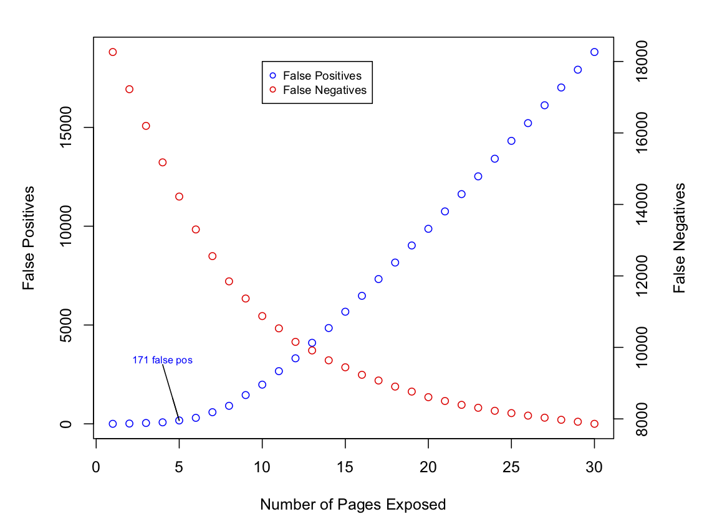

# Initial Findings Regarding Front Matter Identification in HT

My goal in this exploratory work was to assess the overall feasibility
of applying machine learning techniques to the problem of discriminating
between *factual* and *creative* content in the initial pages of
Hathi Trust (HT) volumes.  The basic problem statement runs like so:
Given a HT volume *V*, analyze the first *n* pages of *V* (where *n*
is a small integer, on the order of 5-30).  For each of these *n* pages
*p1, p2, ..., pn*, we seek a prediction
*p'i* in *{factual, creative}* that can guide
a decision whether or not to expose *pi* to the public.

N.B. In my analysis, I refer to *factual* and *creative* as *open* and
*closed*, respectively.  Thus the aim is make a prediction in 
*{open, closed}* for each page *pi*.

The page labels used in this analysis are described in
* Lara McConnaughey, Jennifer Dai and David Bamman (2017), "The Labeled Segmentation of Printed Books" (EMNLP 2017)
and are available [here](https://github.com/dbamman/book-segmentation).  The
data consist of 1055 HT volumes with publication dates between 1750 and 1922.
These 1055 volumes contain a total of 294,816 pages.
For each volume in the data set, McConnoaughey et al labeled each page with one
of ten categories (e.g. TOC, index, title page, advertisement, main text, etc.)

It is worth
noting that the volumes and labels used here were collected in service to a problem
similar to the one we are considering but not identical to it. The salient 
differences between McConnaughey et al's problem and our are:
* *Dates:* While our interest lies in volumes published after 1922, McConnaughey
et al selected volumes published in or prior to 1922.
* *Labels:* Our task is simpler than MConnaughey's.  Instead of predicting the
structural role that each plays in a given volume, our aim is simply to assess
whether each page is inherently *factual* or *creative*.  In other words, our
target variable's sample space is of size 2, while McConnaughey et al treat
the target as a 10-category variable.  This analysis resolves this difference
by mapping each of McConnaughey et al's 10 categories onto *{factual/open,
creative/closed}*
 

## Selection of *n*, The Number of Pages Under Consideration
Before approaching the task of labeling individual pages, we considered 
simpler question: *Is it possible to select an integer n such that exposing the
first n pages of all volumes will show a reasonable proportion of factual content
while hiding most of the creative content?*

**Figure 1. False Positive/Negative Counts as a Function of *N*, the Number of Pages Exposed**

Figure 1 suggests that this approach does not lead to a satisfying outcome.  The
figure shows two plots (hence the different scales shown on the graph's *y*-axis).  
In both plots the *x*-axis is *n*, the number of pages hypothetically 
exposed per volume. In blue, the figure shows the number of false positives at
*n*.  In other words, each blue point gives the number of pages with a *closed*
label (i.e. creative content) erroneously exposed under the hypothetical policy
of opening the first *n* pages per volume.

The red points in the figure correspond to false negatives.  That is, for a given
*n*, how many factual pages have we failed to expose?

Figure 1 suggests that no single value of *n* yields a good outcome.  For instance,
if we chose the very conservative policy of exposing only the first *n=5* pages
of our 1055 volumes we have a very high false negative rate (approximately 14,000
unexposed factual pages), while still incurring 171 exposed creative pages.  
Assuming that false positives (exposed creative/closed pages) is highly 
undesirable, Figure 1 suggests that we need a policy with more nuance than
simply opening the first *n* pages per volume. 

## Prospects for Success using Machine Learning to Expose Factual Pages
In the previous section we explored the "naive" strategy of exposing the first
*n* pages of each volume, and we found this strategy to be too blunt of an
instrument for deployment in the wild.  A more nuanced approach is to learn
of a function *f(pi)* that, given as input a page *pi*
returns a prediction *o'i* that quantifies that likelihood that
*pi* is of class *open*.  In this section we discuss initial
results on the feasibility of learning such a function *f* using machine learning
techniques.

### Training Data
We use the labels created by McConnaughey et al to train the models described
below.  Thus we have 294,816 possible training instances--i.e. the labeled pages
from 1055 volumes.  However, we have altered these data slightly to suit our
needs more closely.  In particular, we altered the training data in two ways:
* *Target Variable:* As described above, we map each of the 10 structural page
categories used by McConnaughey et al onto the simpler scheme of *{open, closed}*.
For instance, pages labeled by McConnaughey et al as *TOC* take the label *open*
in our data, while pages labeled *preface* by McConnaughey are considered creative
and thus carry a *closed* label in our datas.
* *Pages Under Consideration:* Though not strictly necessary, we have limited our
consideration to pages with sequence numbers <= 30.  That is, we consider only
the first 30 (or fewer) pages per volume in our analysis.  Thus we work with a total
of 30,266 labeled pages in the following discussion.

**Predictor Variables**
To test the feasibility of using machine learning for the task at hand, we 
generated a set of 11 simple features for each of our 30,266 pages.

| Variable Name			| Description					|
| seq				| The sequence/page number			|
| log_seq			| The log of the sequence number		|
| token_count			| Number of tokens on the page			|
| token_count_normalized	| (token_count - mean_tok_count)/std(tok_count)	|
| line_count			| Number of lines of text on the page		|
| line_count_normalized		| (line_count - mean_line_count)/std(line_count)|
| empty_line_count		| Number of empty lines on the page		|
| empty_line_count_normalized	| (empty_lc - mean_empty_lc) / std(empty_lc)	|
| cap_alpha_seq			| Longest observed sequence of alphabetical caps|
| pct_begin_char_caps		| % of lines that begin with a capital letter	|
| pct_end_char_numeric		| % of lines that end with a roman numeral	|
**Table 1. Predictor Variables per Page.  N.B. Averages and Std Deviations are
taken at the volume level.**
